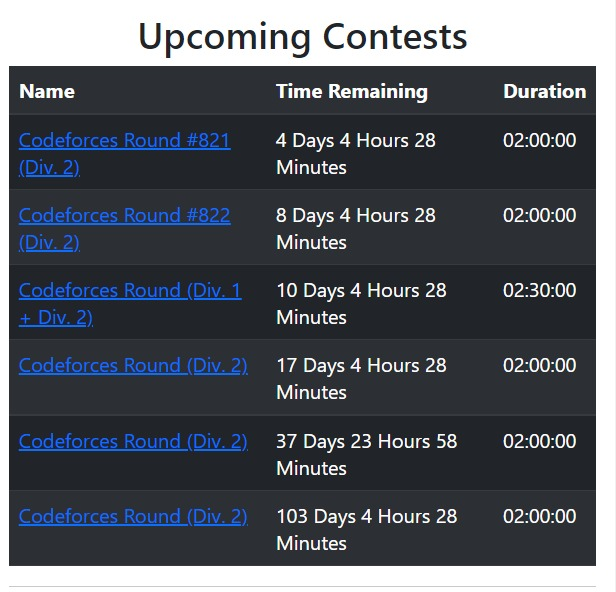

# Codeforces Helper

This extension displays reminders for upcoming contests, suggest problems to solve as per the chosen rating range and topic and also gives a list of non-conflicting contests given a list of handles which can be used for virtual contests  

## Usage

In order to use the extension follow the steps given below:

- Clone this github repo.
- Add the extension to your browser by going to extensions page of the browser, enabling the developer mode, clicking the load unpacked button and choosing the folder.
- Once the extension is added, click it to open the popup page.

## Features

### Upcoming Contests

The extension fetches the list of the upcoming contests and displays it in a tabular format.

### Topicwise and Ratingwise Questions

For the given rating range, topic and handle, the extension finds 5 unsolved problems for the given handle. If no handle name is provided then the list of questions may contain already solved problems.
### Virtual Contests

For a given group of users, the extension finds the contests with no solved questions by any of the user so that it can be used for group virtual contests.

